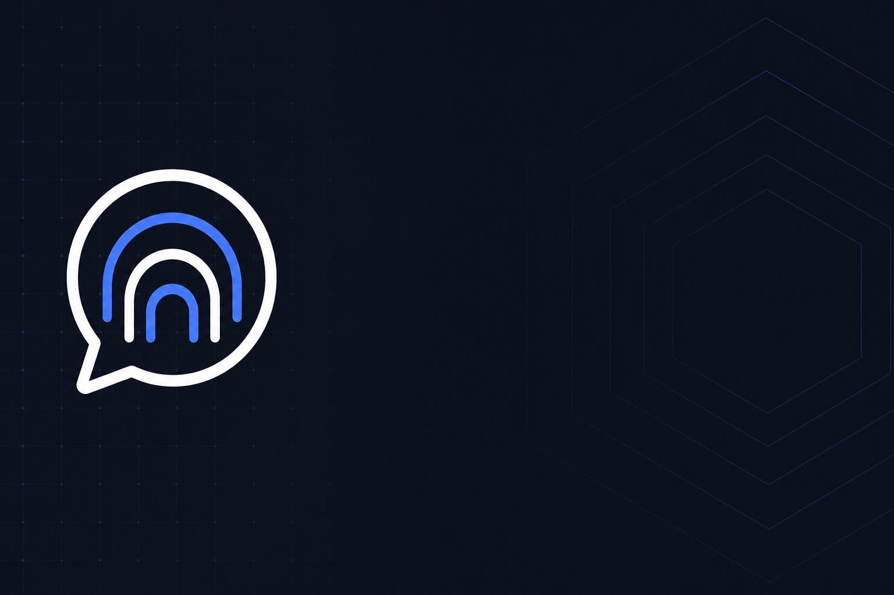
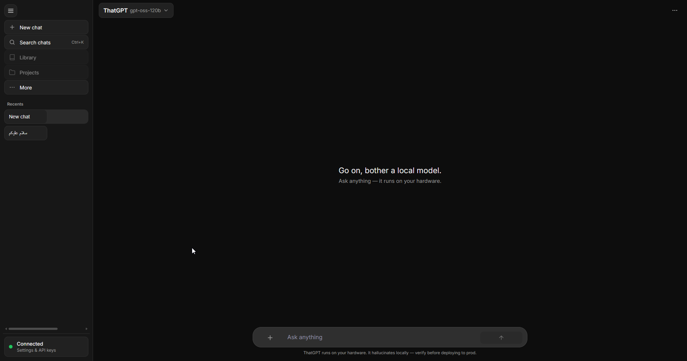
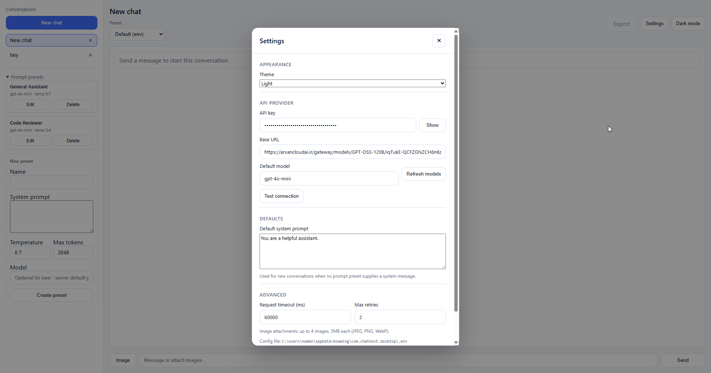
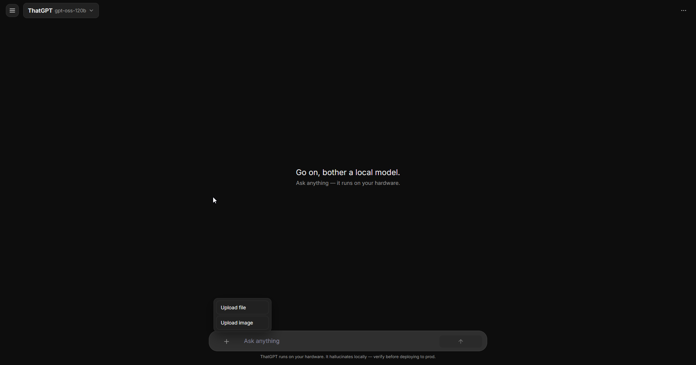

<div align="center">


# ChatNest

**Local-first desktop chat for OpenAI-compatible APIs**

[](CHANGELOG.md)
[](LICENSE)
[](src-tauri/)
[](src-tauri/)
[](client/)
[](#installation)

[Features](#features) · [Screenshots](#screenshots) · [Installation](#installation) · [Development](#development) · [Build](#build) · [Changelog](CHANGELOG.md) · [Trust](#trust) · [Contributing](CONTRIBUTING.md)



</div>

---

## Description

ChatNest is a stable, open-source desktop chat client (v2). Conversations, prompt presets, and multimodal attachments are handled in a React UI. A **Rust + Tauri** backend stores data as JSON on disk and proxies all model requests so your API key never enters the webview.

**Design goals:** credentials stay in the desktop shell, no database overhead, any OpenAI-compatible endpoint.

## Features

| | |
|---|---|
| **Chat** | Persistent threads stored locally as JSON |
| **Vision** | JPEG, PNG, WebP attachments with server-side validation |
| **Presets** | Reusable system prompts with model, temperature, and token limits |
| **Themes** | Light / dark UI with CSS variable design tokens |
| **Reliability** | Retries, timeouts, and clear errors for provider failures |
| **Settings UI** | API key, provider URL, model, prompts, timeout — all editable in-app |
| **Streaming** | Assistant replies appear token-by-token |
| **Export** | Download conversations as Markdown or JSON |

## Screenshots

<table>
<tr>
<td width="33%"><br /><sub>Main chat</sub></td>
<td width="33%"><br /><sub>Prompt presets</sub></td>
<td width="33%"><br /><sub>Dark theme</sub></td>
</tr>
</table>

<p align="center">
  
  <br />
  <sub>Demo GIF</sub>
</p>

## Installation

### Download (recommended)

1. Open [GitHub Releases](https://github.com/Satan2049/chat-nest/releases).
2. Download **portable** `.exe` or **setup** installer for Windows x64.
3. Verify checksums — see [docs/TRUST.md](docs/TRUST.md) and [`SHA256.txt`](SHA256.txt).
4. *(Optional)* Review [VirusTotal reports](docs/TRUST.md#published-reports-v110) for the release binaries.

### Configure API access

Open **Settings** in the app (header) to set your API key, base URL, default model, system prompt, timeout, and retries. Settings are saved to:

```text
%APPDATA%\com.chatnest.desktop\.env
```

You can also edit that file manually — see [`src-tauri/.env.example`](src-tauri/.env.example):

```env
AI_API_KEY=your-key-here
AI_BASE_URL=https://api.openai.com/v1
AI_MODEL=gpt-4o-mini
AI_DEFAULT_SYSTEM_PROMPT=You are a helpful assistant.
AI_REQUEST_TIMEOUT_MS=60000
AI_MAX_RETRIES=2
```

### Build from source

Requires Node.js 20+, Rust, and [WebView2](https://developer.microsoft.com/en-us/microsoft-edge/webview2/) on Windows.

```bash
git clone https://github.com/Satan2049/chat-nest.git
cd chat-nest
npm install
npm run build
```

Portable binary: `src-tauri/target/release/bundle/portable/ChatNest.exe`

## Development

```bash
npm install
npm run dev          # Tauri + Vite hot reload
npm run test:rust    # Rust unit tests
npm run build:client # Frontend only
```

Config template: [`src-tauri/.env.example`](src-tauri/.env.example)

| Variable | Description |
|----------|-------------|
| `AI_API_KEY` | Provider API key (required) |
| `AI_BASE_URL` | OpenAI-compatible base URL |
| `AI_MODEL` | Default model id |
| `AI_DEFAULT_SYSTEM_PROMPT` | Fallback system message for new chats |
| `AI_REQUEST_TIMEOUT_MS` | Provider request timeout (ms) |
| `AI_MAX_RETRIES` | Retry count for transient API errors |

See [CONTRIBUTING.md](CONTRIBUTING.md) for pull request guidelines.

## Build

### Windows desktop

| Command | Output |
|---------|--------|
| `npm run build` | NSIS installer + portable EXE |
| `npm run build:portable` | Portable EXE only |
| `npm run release:package` | Stage `release/` folder with ZIPs |
| `npm run release:hashes` | Generate `SHA256.txt` |

Artifacts:

```text
src-tauri/target/release/bundle/portable/ChatNest.exe
src-tauri/target/release/bundle/nsis/ChatNest_*_x64-setup.exe
release/                                    # after release:package
SHA256.txt                                  # after release:hashes
```

### Android (Tauri mobile)

**Prerequisites:** [Android Studio](https://developer.android.com/studio), Android SDK, NDK, and Rust Android targets (`rustup target add aarch64-linux-android armv7-linux-androideabi i686-linux-android x86_64-linux-android`).

One-time setup:

```bash
npm install
npm run android:init    # creates src-tauri/gen/android/
```

Development (device or emulator):

```bash
npm run android:dev
```

Release APK/AAB:

```bash
npm run android:build
```

Outputs land under `src-tauri/gen/android/app/build/outputs/`.

Platform config: [`src-tauri/tauri.android.conf.json`](src-tauri/tauri.android.conf.json) (bundle id `com.chatnest.app`).

### iOS (macOS only)

```bash
npm run ios:init
npm run ios:dev
npm run ios:build
```

Requires Xcode on macOS. Config: [`src-tauri/tauri.ios.conf.json`](src-tauri/tauri.ios.conf.json).

## Architecture

```text
React UI (Vite)
      │  Tauri invoke
      ▼
Rust services ──► OpenAI-compatible API
      │
      └── JSON: %APPDATA%/com.chatnest.desktop/data/
```

Details: [`docs/repository-intelligence.md`](docs/repository-intelligence.md)

## Tech stack

| Layer | Technology |
|-------|------------|
| Desktop shell | [Tauri 2](https://v2.tauri.app/) |
| Backend | Rust, Tokio, Reqwest, Serde |
| Frontend | React 18, Vite, TypeScript, Zustand |
| Storage | File-based JSON |
| AI | OpenAI-compatible `/chat/completions` |

## Trust

- Verify downloads: [docs/TRUST.md](docs/TRUST.md)
- Report security issues: [SECURITY.md](SECURITY.md)
- Checksums: [`SHA256.txt`](SHA256.txt)

## License

[MIT](LICENSE) © ChatNest contributors
