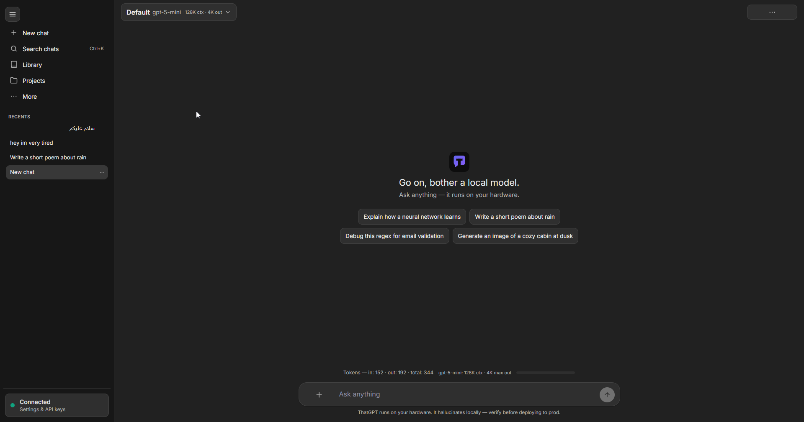
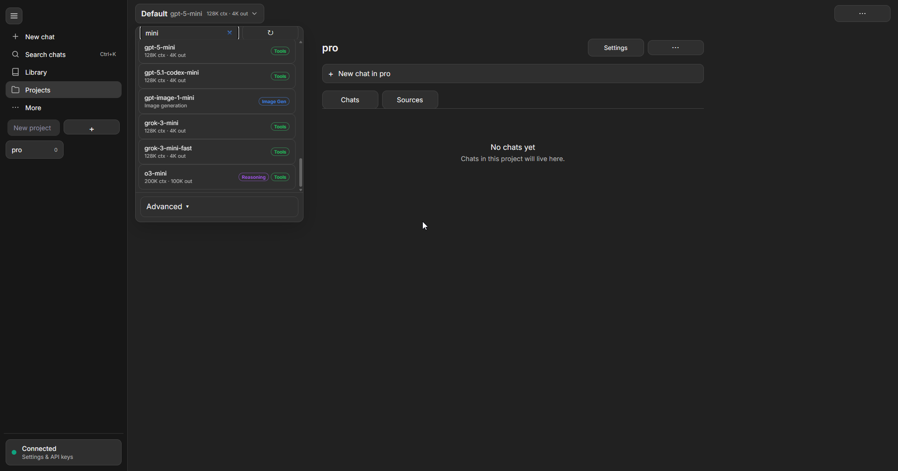
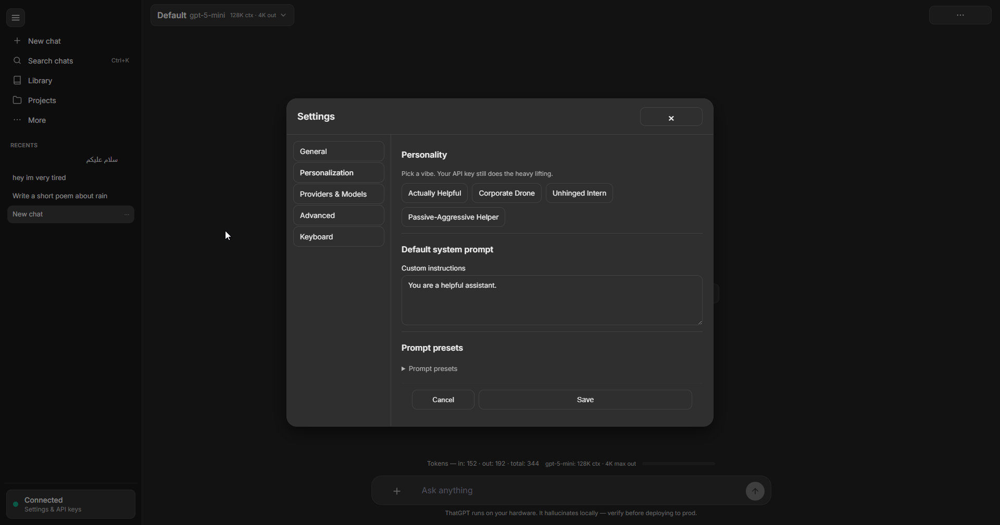
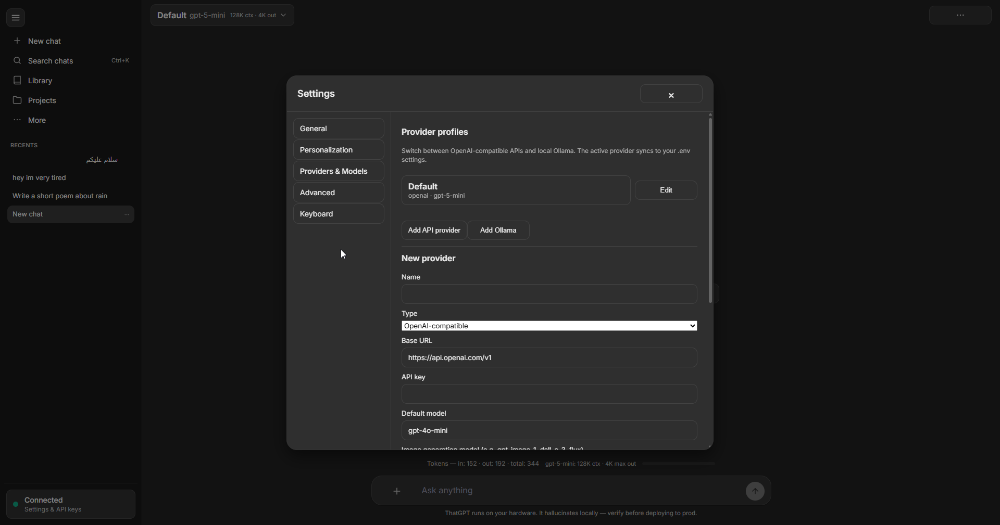
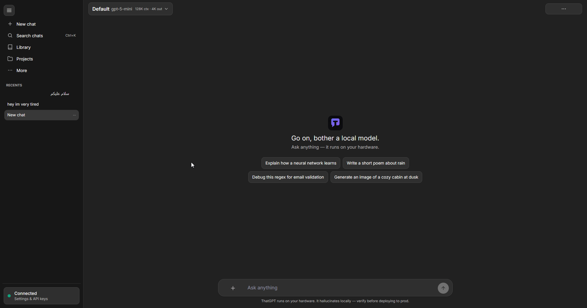

<div align="center">


# ThatGPT

**Local ChatGPT-style desktop chat for OpenAI-compatible APIs and Ollama**

[](CHANGELOG.md)
[](LICENSE)
[](src-tauri/)
[](src-tauri/)
[](client/)
[](#installation)

[Features](#features) · [Screenshots](#screenshots) · [Installation](#installation) · [Development](#development) · [Build](#build) · [Changelog](CHANGELOG.md) · [Trust](#trust) · [Contributing](CONTRIBUTING.md)

**[Landing page](https://satan2049.github.io/that-gpt/)** · **[v2.5.0 release notes](docs/RELEASE_v2.5.0.md)**


</div>

---

## Description

**ThatGPT** is an open-source **Windows desktop** chat client with a ChatGPT-inspired UI. Conversations, prompt presets, and multimodal attachments live in a React UI. A **Rust + Tauri** backend stores JSON on disk and proxies all model requests so your API key never enters the webview.

**Design goals:** credentials stay in the desktop shell, no database overhead, any OpenAI-compatible endpoint or local Ollama.

## Features

| | |
|---|---|
| **ChatGPT-like UI** | Sidebar nav, pill composer, model dropdown, tabbed settings |
| **Providers** | Multiple OpenAI-compatible profiles + Ollama (`/api/tags`) |
| **Streaming** | True SSE streaming with smart scroll and stop generation |
| **Agent tools** | Web search, knowledge search, analyze image/audio, **generate images** |
| **Vision & image gen** | Separate badges — see images vs create images (`gpt-image-1`, DALL·E) |
| **RAG** | Local knowledge base with embeddings, chunking, citation footnotes |
| **Library** | Browse all attachments across conversations |
| **Markdown** | GFM, LaTeX (KaTeX), Mermaid diagrams, syntax-highlighted code |
| **Conversations** | Pin, archive, folders, Ctrl+K search, ephemeral (temporary) chat |
| **Power user** | Branching, fork, templates, bookmarks, command palette, HTML export |
| **Tokens & cost** | Usage footer, context bar, editable per-model pricing |
| **Themes** | Light / dark with `prefers-reduced-motion` |
| **Export** | Markdown, JSON, HTML share; copy thread as Markdown |

## Screenshots

<table>
<tr>
<td width="33%"><br /><sub>Main chat</sub></td>
<td width="33%"><br /><sub>Models list</sub></td>
<td width="33%"><br /><sub>Personalization setting</sub></td>
<td width="33%"><br /><sub>Providers setting</sub></td>
</tr>
</table>

<p align="center">
  
  <br />
  <sub>Demo GIF</sub>
</p>

## Installation

### Download (recommended)

1. Open **[GitHub Releases — v2.5.0](https://github.com/Satan2049/that-gpt/releases/tag/v2.5.0)**.
2. Download **portable** `.exe` or **NSIS setup** installer for Windows x64.
3. Verify checksums — [`SHA256.txt`](SHA256.txt) and [docs/TRUST.md](docs/TRUST.md).
4. *(Optional)* Review [VirusTotal reports (v2.5.0)](docs/TRUST.md#published-reports-v250) after maintainers upload scans.

### Configure API access

Open **Settings** in the app (header `···` menu) to set your API key, providers, models, and optional features (web search, knowledge base, dev mode). Settings are saved to:

```text
%APPDATA%\com.thatgpt.desktop\.env
```

You can also edit that file manually — see [`src-tauri/.env.example`](src-tauri/.env.example):

```env
AI_API_KEY=your-key-here
AI_BASE_URL=https://api.openai.com/v1
AI_MODEL=gpt-4o-mini
AI_DEFAULT_SYSTEM_PROMPT=You are a helpful assistant.
AI_REQUEST_TIMEOUT_MS=60000
AI_MAX_RETRIES=2
```

**Ollama:** Add an Ollama provider in Settings → Providers (`http://127.0.0.1:11434`).

### Build from source

Requires Node.js 20+, Rust, and [WebView2](https://developer.microsoft.com/en-us/microsoft-edge/webview2/) on Windows.

```bash
git clone https://github.com/Satan2049/that-gpt.git
cd that-gpt
npm install
npm run build
```

Portable binary: `src-tauri/target/release/bundle/portable/ThatGPT.exe`

## Development

```bash
npm install
npm run dev          # Tauri + Vite hot reload
npm run test:rust    # Rust unit tests
npm run build:client # Frontend only
npm run clean        # Remove build artifacts & temp files
```

Config template: [`src-tauri/.env.example`](src-tauri/.env.example)

| Variable | Description |
|----------|-------------|
| `AI_API_KEY` | Provider API key (required for cloud APIs) |
| `AI_BASE_URL` | OpenAI-compatible base URL |
| `AI_MODEL` | Default model id |
| `AI_IMAGE_MODEL` | Image **generation** model (e.g. `gpt-image-1`) |
| `AI_DEFAULT_SYSTEM_PROMPT` | Fallback system message for new chats |
| `AI_REQUEST_TIMEOUT_MS` | Provider request timeout (ms) |
| `AI_MAX_RETRIES` | Retry count for transient API errors |

See [CONTRIBUTING.md](CONTRIBUTING.md) for pull request guidelines.

## Build

### Windows desktop

| Command | Output |
|---------|--------|
| `npm run build` | NSIS installer + portable EXE |
| `npm run build:portable` | Portable EXE only |
| `npm run release:package` | Stage `release/` folder with ZIPs |
| `npm run release:hashes` | Regenerate `SHA256.txt` from built artifacts |
| `npm run clean` | Delete `target/`, `client/dist/`, caches, logs |
| `npm run clean:all` | Also remove `node_modules` and `release/` |

Artifacts:

```text
src-tauri/target/release/bundle/portable/ThatGPT.exe
src-tauri/target/release/bundle/nsis/ThatGPT_*_x64-setup.exe
release/                                    # after release:package
SHA256.txt                                  # after release:hashes
```

### Ship a GitHub release

```powershell
npm run build
npm run release:package
npm run release:hashes
# Upload release/*.exe, release/*.zip, SHA256.txt
# Add VirusTotal links to docs/TRUST.md and docs/RELEASE_v2.5.0.md
```

## Architecture

```text
React UI (Vite)
      │  Tauri invoke
      ▼
Rust services ──► OpenAI-compatible API / Ollama
      │
      └── JSON: %APPDATA%/com.thatgpt.desktop/data/
```

Details: [`docs/repository-intelligence.md`](docs/repository-intelligence.md)

## Tech stack

| Layer | Technology |
|-------|------------|
| Desktop shell | [Tauri 2](https://v2.tauri.app/) |
| Backend | Rust, Tokio, Reqwest, Serde |
| Frontend | React 18, Vite, TypeScript, Zustand |
| Storage | File-based JSON |
| AI | OpenAI-compatible `/chat/completions`, `/images/generations`, embeddings |

## Trust

- Verify downloads: [docs/TRUST.md](docs/TRUST.md)
- Release notes: [docs/RELEASE_v2.5.0.md](docs/RELEASE_v2.5.0.md)
- Report security issues: [SECURITY.md](SECURITY.md)
- Checksums: [`SHA256.txt`](SHA256.txt)

## License

[MIT](LICENSE) © ThatGPT contributors
