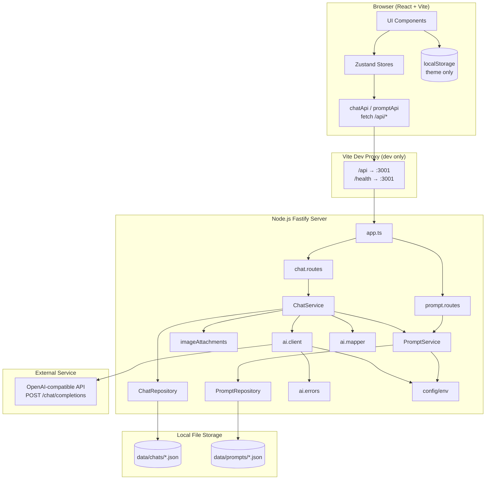
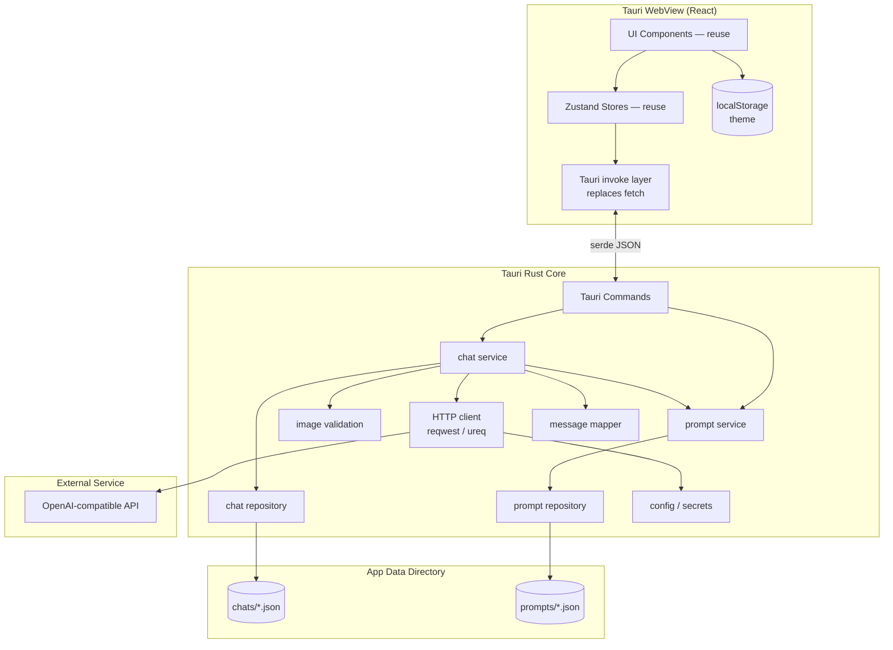
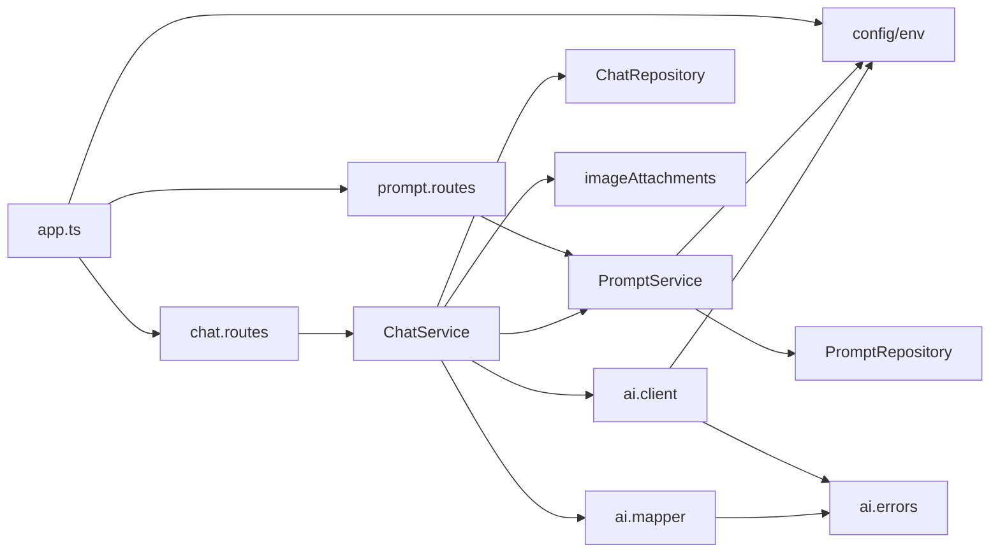
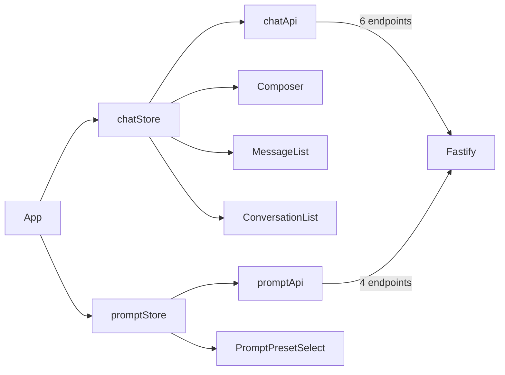

# Repository Intelligence — ThatGPT

> Historical pre-migration architectural analysis (original Node/Fastify prototype).  
> **ThatGPT** now ships as Tauri 2 + Rust + React. This document is kept for reference.

---

## 1. Executive Summary

**ThatGPT** (Tauri desktop app) is a local-first chat client with an OpenAI-compatible API proxy. The **legacy** architecture described below was a **two-process web app**: a React SPA (Vite dev server) talked to a Fastify HTTP backend that persisted JSON files and forwarded AI requests.

| Metric | Value |
|--------|-------|
| Repository size | ~57 tracked source/config files |
| Monorepo layout | Root orchestrator + `client/` + `server/` |
| Backend modules | 2 domain modules (chat, prompt) + 1 provider (AI) |
| HTTP endpoints | 12 (including health) |
| External services | 1 (OpenAI-compatible chat completions API) |
| Database | None — file-based JSON |
| Authentication | None |
| Test coverage | 2 server unit test files (image validation, AI errors) |

**Migration thesis:** The entire `server/` package must be rewritten in Rust as Tauri commands (or an internal Rust library invoked by Tauri). The React frontend can largely be preserved inside Tauri's WebView, with the HTTP `fetch` layer replaced by Tauri IPC (`invoke`). Data format (JSON files) can remain compatible to ease migration.

---

## 2. Architecture Diagram

### 2.1 Current (Web) Architecture



### 2.2 Target (Tauri) Architecture



---

## 3. Technology Stack Analysis

### 3.1 Root / Workspace

| Layer | Technology | Version / Notes |
|-------|------------|-----------------|
| Package manager | npm | Workspaces-style via `--prefix` scripts |
| Node requirement | Node.js | ≥ 20 |
| Orchestration | Root `package.json` | `dev:client`, `dev:server`, `build:*`, `test` |
| CI / Docker | — | Not present |
| Tauri / Rust | — | **Not present** (greenfield for migration) |

### 3.2 Frontend (`client/`)

| Category | Choice | Details |
|----------|--------|---------|
| Framework | React 18 | Functional components, hooks |
| Build tool | Vite 4 | `@vitejs/plugin-react` |
| Language | TypeScript 5.8 | Strict mode |
| State | Zustand 5 | Two stores: `chatStore`, `promptStore` |
| Routing | None | Single-page app, no react-router |
| Styling | Plain CSS | CSS variables, `data-theme="light\|dark"` |
| HTTP | Native `fetch` | Relative `/api/*` paths, proxied in dev |
| Testing | None | No frontend tests despite master plan mention |

**Feature modules:**

```
client/src/
├── App.tsx                          # Shell layout, theme toggle
├── features/
│   ├── chat/
│   │   ├── components/              # ConversationList, MessageList, Composer
│   │   ├── services/chatApi.ts      # HTTP client (migration touchpoint)
│   │   ├── store/chatStore.ts       # State orchestration
│   │   ├── lib/                     # Image limits, base64 reader
│   │   └── types/
│   └── prompt/
│       ├── components/              # PromptPresetPanel, PromptPresetSelect
│       ├── services/promptApi.ts    # HTTP client (migration touchpoint)
│       ├── store/promptStore.ts
│       └── types/
└── shared/styles/global.css
```

### 3.3 Backend (`server/`)

| Category | Choice | Details |
|----------|--------|---------|
| Runtime | Node.js ESM | `"type": "module"` |
| HTTP framework | Fastify 5 | Logger, 32 MB body limit, CORS enabled |
| Language | TypeScript 5.8 | Compiled to `dist/` |
| Validation | Zod 4 | Request body schemas |
| Config | dotenv | `server/.env` |
| Dev runner | tsx watch | Hot reload |
| Tests | Node built-in test | `tsx --test src/**/*.test.ts` |
| Persistence | Node `fs/promises` | One JSON file per entity |
| AI integration | Native `fetch` | OpenAI-compatible REST |

**Backend module layout:**

```
server/src/
├── app.ts                           # Entry point, route registration
├── config/env.ts                    # Environment variables
├── modules/
│   ├── chat/
│   │   ├── chat.routes.ts           # HTTP handlers
│   │   ├── chat.service.ts          # Business logic
│   │   ├── chat.repository.ts       # File I/O
│   │   ├── chat.schema.ts           # Zod validation
│   │   ├── chat.types.ts
│   │   └── imageAttachments.ts      # Base64 image validation
│   └── prompt/
│       ├── prompt.routes.ts
│       ├── prompt.service.ts
│       ├── prompt.repository.ts
│       ├── prompt.schema.ts
│       └── prompt.types.ts
└── providers/ai/
    ├── ai.client.ts                 # HTTP to provider + retries
    ├── ai.mapper.ts                 # Domain → OpenAI message format
    ├── ai.errors.ts                 # Error classification
    └── ai.types.ts
```

### 3.4 Build System

| Target | Command | Output |
|--------|---------|--------|
| Client dev | `npm run dev:client` | Vite on `:5173`, proxies API |
| Server dev | `npm run dev:server` | tsx watch on `:3001` |
| Client prod | `npm run build:client` | Static assets (default `client/dist/`) |
| Server prod | `npm run build:server` | `server/dist/` → `node dist/app.js` |
| Tests | `npm run test` | Server unit tests only |

### 3.5 Documentation & Static Site

| Path | Purpose |
|------|---------|
| `docs/master_plan.md` | Product spec, API design, roadmap |
| `docs/stages.md` | Implementation stages (1–6 complete) |
| `docs/index.html` | GitHub Pages landing page |
| `README.md` | User-facing setup and API summary |

---

## 4. Backend Responsibilities

### 4.1 HTTP API Layer

Fastify registers routes, parses JSON bodies (up to 32 MB), validates with Zod, maps errors to HTTP status codes, and enables CORS for browser dev.

**Responsibilities:**
- Route registration and request/response serialization
- Input validation and 400 error responses
- 404 for missing entities
- 502 for AI provider failures
- Health check endpoint

### 4.2 Chat Domain

| Responsibility | Implementation |
|----------------|----------------|
| Conversation CRUD | `ChatService` + `ChatRepository` |
| Message send orchestration | Append user msg → call AI → append assistant msg → persist |
| Auto-title on first message | Truncate user text to 60 chars or "Image message" |
| Preset binding | `promptPresetId` on conversation, validated on patch/send |
| System prompt injection | Preset or `AI_DEFAULT_SYSTEM_PROMPT` if no system message in history |
| History → API mapping | `chatMessagesToCompletionMessages` with vision support |

### 4.3 Prompt Domain

| Responsibility | Implementation |
|----------------|----------------|
| Preset CRUD | `PromptService` + `PromptRepository` |
| Built-in seed data | Creates "General Assistant" and "Code Reviewer" when prompts dir is empty |
| Default model fallback | Uses `env.aiModel` when preset model omitted |

### 4.4 File Processing

| Operation | Location | Details |
|-----------|----------|---------|
| Conversation persistence | `data/chats/{uuid}.json` | Full conversation incl. messages and embedded base64 images |
| Preset persistence | `data/prompts/{uuid}.json` | Preset metadata |
| Directory bootstrap | Repositories | `mkdir` recursive on first write |
| Listing | Repositories | Read dir, filter `.json`, sort by `updatedAt` desc |
| Image validation | `imageAttachments.ts` | MIME whitelist, base64 decode, 5 MB limit, max 4 images |

**Not present:** multipart upload, image file storage on disk, streaming, export/import, SQLite.

### 4.5 External Services

| Service | Protocol | Endpoint | Auth |
|---------|----------|----------|------|
| OpenAI-compatible provider | HTTPS REST | `{AI_BASE_URL}/chat/completions` | Bearer `AI_API_KEY` |

**Client behavior:**
- Configurable timeout (`AI_REQUEST_TIMEOUT_MS`, default 60s)
- Retry with exponential backoff (`AI_MAX_RETRIES`, default 2)
- Retries on 429, 502, 503, 504 and network/timeout errors
- Error classification: `invalid-key`, `rate-limit`, `timeout`, `network`, `provider`, `unknown`
- User-friendly error messages surfaced to frontend

### 4.6 Configuration & Security

| Variable | Default | Role |
|----------|---------|------|
| `PORT` | 3001 | Server listen port |
| `AI_API_KEY` | — | Provider credential (required for send) |
| `AI_BASE_URL` | `https://api.openai.com/v1` | Provider base URL |
| `AI_MODEL` | `gpt-4o-mini` | Default model |
| `AI_DEFAULT_SYSTEM_PROMPT` | empty | Fallback system prompt |
| `AI_REQUEST_TIMEOUT_MS` | 60000 | Request timeout |
| `AI_MAX_RETRIES` | 2 | Retry count |

**Security posture:**
- API key server-side only (never sent to browser)
- No authentication on HTTP API
- Image validation on server (defense in depth; client also validates)
- No input sanitization beyond schema validation
- No file locking on concurrent writes

---

## 5. Complete API Endpoint Reference

### 5.1 Health

| Method | Path | Handler | Request | Success Response | Error Codes |
|--------|------|---------|---------|------------------|-------------|
| `GET` | `/health` | `app.ts` | — | `{ status: "ok", service: "thatgpt-server" }` | — |

### 5.2 Chat

| Method | Path | Handler | Request Body | Success Response | Error Codes |
|--------|------|---------|--------------|------------------|-------------|
| `GET` | `/api/chat/conversations` | `chat.routes` | — | `ConversationSummary[]` | — |
| `GET` | `/api/chat/conversations/:id` | `chat.routes` | — | `Conversation` | 404 |
| `POST` | `/api/chat/conversations` | `chat.routes` | `{ title?: string }` | `Conversation` (201) | 400 |
| `PATCH` | `/api/chat/conversations/:id` | `chat.routes` | `{ title?, promptPresetId? }` | `Conversation` | 400, 404 |
| `DELETE` | `/api/chat/conversations/:id` | `chat.routes` | — | 204 empty | 404 |
| `POST` | `/api/chat/send` | `chat.routes` | See schema below | `{ assistantMessage, conversation }` | 400, 404, 502 |

**`POST /api/chat/send` body schema (Zod):**

```json
{
  "conversationId": "uuid",
  "message": "string (max 32000)",
  "promptPresetId": "uuid | null (optional)",
  "images": [
    { "mimeType": "image/jpeg|png|webp", "base64": "string" }
  ]
}
```

Max 4 images. Message text or at least one image required.

### 5.3 Prompts

| Method | Path | Handler | Request Body | Success Response | Error Codes |
|--------|------|---------|--------------|------------------|-------------|
| `GET` | `/api/prompts` | `prompt.routes` | — | `PromptPreset[]` | — |
| `GET` | `/api/prompts/:id` | `prompt.routes` | — | `PromptPreset` | 404 |
| `POST` | `/api/prompts` | `prompt.routes` | Create schema | `PromptPreset` (201) | 400 |
| `PUT` | `/api/prompts/:id` | `prompt.routes` | Update schema | `PromptPreset` | 400, 404 |
| `DELETE` | `/api/prompts/:id` | `prompt.routes` | — | 204 empty | 404 |

**Create preset body:** `{ name, systemPrompt, temperature?, maxTokens?, model? }`  
**Update preset body:** `{ name, systemPrompt, temperature, maxTokens, model }` (all required)

### 5.4 Frontend → Backend Call Matrix

| Frontend function | HTTP call |
|-------------------|-----------|
| `apiListConversations` | `GET /api/chat/conversations` |
| `apiGetConversation` | `GET /api/chat/conversations/:id` |
| `apiCreateConversation` | `POST /api/chat/conversations` |
| `apiPatchConversation` | `PATCH /api/chat/conversations/:id` |
| `apiDeleteConversation` | `DELETE /api/chat/conversations/:id` |
| `apiSendMessage` | `POST /api/chat/send` |
| `apiListPrompts` | `GET /api/prompts` |
| `apiCreatePreset` | `POST /api/prompts` |
| `apiUpdatePreset` | `PUT /api/prompts/:id` |
| `apiDeletePreset` | `DELETE /api/prompts/:id` |

Note: `GET /api/prompts/:id` is implemented on the server but **not called** by the current frontend.

---

## 6. Data Models

### 6.1 Conversation (`data/chats/{id}.json`)

```typescript
{
  id: string;           // UUID
  title: string;
  messages: ChatMessage[];
  promptPresetId?: string;
  createdAt: string;  // ISO 8601
  updatedAt: string;
}
```

### 6.2 ChatMessage

```typescript
{
  id: string;
  conversationId: string;
  role: "system" | "user" | "assistant";
  content: string;
  createdAt: string;
  images?: Array<{ mimeType: "image/jpeg"|"image/png"|"image/webp"; base64: string }>;
}
```

### 6.3 PromptPreset (`data/prompts/{id}.json`)

```typescript
{
  id: string;
  name: string;
  systemPrompt: string;
  temperature: number;   // 0–2
  maxTokens: number;     // 1–128000
  model: string;
  createdAt: string;
  updatedAt: string;
}
```

---

## 7. Dependency Graph

### 7.1 Runtime Dependency Graph (Backend)



### 7.2 Frontend → Backend Coupling



### 7.3 npm Dependency Inventory

**Server production dependencies:**

| Package | Purpose | Rust equivalent (suggested) |
|---------|---------|----------------------------|
| `fastify` | HTTP server | Tauri commands (no HTTP server needed) |
| `@fastify/cors` | CORS | Not needed in Tauri |
| `dotenv` | Env loading | `dotenvy` or Tauri config |
| `zod` | Validation | `serde` + `validator` or manual validation |

**Client production dependencies:**

| Package | Purpose | Migration note |
|---------|---------|----------------|
| `react` / `react-dom` | UI | Keep in WebView |
| `zustand` | State | Keep; swap service layer |

**Server dev dependencies:** `tsx`, `typescript`, `@types/node` — replaced by Rust toolchain.

---

## 8. Modules Requiring Rust Rewrite

Every file under `server/src/` maps to Rust code. Grouped by migration priority:

### 8.1 Must Rewrite (Core Backend)

| Current Module | Lines (approx.) | Rust Target | Complexity |
|----------------|-----------------|-------------|------------|
| `config/env.ts` | ~13 | `config.rs` / Tauri managed state | Low |
| `chat.repository.ts` | ~62 | `chat/repository.rs` | Low |
| `prompt.repository.ts` | ~58 | `prompt/repository.rs` | Low |
| `chat.service.ts` | ~213 | `chat/service.rs` | Medium |
| `prompt.service.ts` | ~106 | `prompt/service.rs` | Low |
| `imageAttachments.ts` | ~62 | `chat/image_validation.rs` | Low |
| `ai.client.ts` | ~90 | `providers/ai/client.rs` | Medium |
| `ai.mapper.ts` | ~43 | `providers/ai/mapper.rs` | Low |
| `ai.errors.ts` | ~102 | `providers/ai/errors.rs` | Low |
| `chat.schema.ts` + `prompt.schema.ts` | ~40 | Serde structs + validation | Low |
| `chat.types.ts` + `prompt.types.ts` + `ai.types.ts` | ~50 | Shared Rust types | Low |
| `chat.routes.ts` + `prompt.routes.ts` | ~144 | Tauri `#[tauri::command]` fns | Medium |
| `app.ts` | ~32 | `lib.rs` / `main.rs` | Low |

### 8.2 Must Adapt (Frontend Integration Layer)

| Current Module | Change Required |
|----------------|-----------------|
| `client/src/features/chat/services/chatApi.ts` | Replace `fetch` with `@tauri-apps/api/core` `invoke` |
| `client/src/features/prompt/services/promptApi.ts` | Same |
| `client/vite.config.ts` | Remove dev proxy; configure Tauri dev path |
| Root `package.json` scripts | Add Tauri dev/build commands |

### 8.3 Can Reuse As-Is (Frontend)

| Module | Notes |
|--------|-------|
| All React components | No server assumptions beyond API layer |
| Zustand stores | Only depend on service modules |
| `global.css` | Theme system works in WebView |
| `imageAttachmentLimits.ts` | Client-side pre-validation still useful |
| `readImageAttachment.ts` | FileReader works in Tauri WebView |
| Type definitions | Can share via duplicated TS types or generated bindings |

### 8.4 Can Deprecate

| Module | Reason |
|--------|--------|
| Entire `server/` package | Replaced by Rust |
| Vite `/api` proxy config | No HTTP hop in desktop app |
| `@fastify/cors` | Not applicable |
| `server/.env` at repo root | Move to Tauri secure storage or app config dir |

### 8.5 Tests to Port

| File | Coverage |
|------|----------|
| `server/src/modules/chat/imageAttachments.test.ts` | Image count, MIME, valid payload |
| `server/src/providers/ai/ai.errors.test.ts` | HTTP error classification, user messages |

---

## 9. Migration Complexity Assessment

### 9.1 Overall Rating: **Medium**

The codebase is small and well-layered (routes → service → repository), which simplifies porting. Complexity comes from the **architectural shift** (HTTP server → desktop IPC) rather than code volume.

| Area | Rating | Rationale |
|------|--------|-----------|
| Backend business logic port | **Medium** | Straightforward CRUD + one external HTTP call; ~700 LOC TypeScript |
| AI client with retries | **Medium** | Must replicate retry/backoff/error taxonomy in async Rust |
| File persistence | **Low** | Simple JSON read/write; use `serde_json` + `tokio::fs` or std::fs |
| Image validation | **Low** | Base64 decode + size checks; `base64` crate |
| Frontend reuse | **Low–Medium** | ~15 React files; only 2 API modules need rewrite |
| Tauri scaffolding | **Medium** | Greenfield; permissions, app data paths, build pipeline |
| Data migration | **Low** | Same JSON schema; path change only |
| Dev experience | **Medium** | Replace dual-process dev with `tauri dev` |

### 9.2 Suggested Migration Phases

1. **Scaffold Tauri** — Initialize project wrapping existing `client/` dist output.
2. **Port types + repositories** — Serde models, file I/O with Tauri app data dir.
3. **Port services** — Chat send flow, prompt CRUD, built-in seeding.
4. **Port AI provider** — reqwest/ureq with timeout, retries, error mapping.
5. **Expose Tauri commands** — 1:1 mapping from current HTTP endpoints.
6. **Swap frontend API layer** — `invoke("send_message", ...)` etc.
7. **Port tests** — Rust unit tests for validation and error classification.
8. **Data path + config UX** — Settings UI or config file for API key and provider URL.
9. **Remove server/** — After parity verification.

### 9.3 Tauri Command Mapping (Proposed)

| HTTP Endpoint | Proposed Tauri Command |
|---------------|------------------------|
| `GET /health` | `health_check` |
| `GET /api/chat/conversations` | `list_conversations` |
| `GET /api/chat/conversations/:id` | `get_conversation` |
| `POST /api/chat/conversations` | `create_conversation` |
| `PATCH /api/chat/conversations/:id` | `update_conversation` |
| `DELETE /api/chat/conversations/:id` | `delete_conversation` |
| `POST /api/chat/send` | `send_message` |
| `GET /api/prompts` | `list_prompts` |
| `GET /api/prompts/:id` | `get_prompt` |
| `POST /api/prompts` | `create_prompt` |
| `PUT /api/prompts/:id` | `update_prompt` |
| `DELETE /api/prompts/:id` | `delete_prompt` |

---

## 10. Risk Areas

### 10.1 High Impact

| Risk | Description | Mitigation |
|------|-------------|------------|
| **Large IPC payloads** | Images sent as base64 in JSON over Tauri invoke; a 4×5 MB message ≈ 20 MB+ serialized | Consider file-path references for images in IPC; or use Tauri events/streams for large payloads |
| **Conversation file bloat** | Base64 images embedded in chat JSON persist forever | Store images as separate files; reference by ID in messages |
| **API key storage** | Currently plain `.env` file | Use OS keychain (`keyring` crate) or Tauri secure plugin |
| **No file locking** | Concurrent writes can corrupt JSON | Add file locks or atomic write (temp + rename) in Rust port |

### 10.2 Medium Impact

| Risk | Description | Mitigation |
|------|-------------|------------|
| **Data directory change** | `process.cwd()/data` → Tauri app data dir | Migration tool to copy existing JSON; document new path |
| **No streaming** | Synchronous completion-only; UX waits for full response | Post-MVP: SSE or Tauri event stream for tokens |
| **Error parity** | Frontend expects `{ error: string }` HTTP errors | Match error shape in Tauri command `Result<T, String>` |
| **Blocking AI calls** | Long requests block Tauri command | Run AI HTTP in `spawn_blocking` or async task; consider progress events |
| **CORS / proxy assumptions** | Dev workflow relies on Vite proxy | Document Tauri-only dev flow |

### 10.3 Low Impact

| Risk | Description | Mitigation |
|------|-------------|------------|
| **Unused endpoint** | `GET /api/prompts/:id` not used by frontend | Optional in initial port |
| **Theme in localStorage** | Works in WebView without changes | None needed |
| **No auth** | Acceptable for local desktop app | Optional future enhancement |
| **Test gap** | No integration or frontend tests | Add Rust integration tests during migration |

---

## 11. File Inventory Summary

| Area | File Count | Key Paths |
|------|------------|-----------|
| Server source | 18 | `server/src/**` |
| Server tests | 2 | `*.test.ts` |
| Client source | 17 | `client/src/**` |
| Config | 7 | `package.json`, `tsconfig.json`, `vite.config.ts`, `.env.example` |
| Docs / assets | 8 | `docs/**`, `README.md` |
| Data (gitignored) | 0 tracked | `server/data/chats/`, `server/data/prompts/` |

---

## 12. Key Observations for Migration Planning

1. **Clean separation of concerns** — The service/repository pattern ports cleanly to Rust modules without structural redesign.

2. **No hidden backend complexity** — No WebSockets, queues, cron jobs, auth middleware, or ORM. The backend is essentially a typed file store plus an HTTP proxy.

3. **Frontend is API-agnostic** — Only `chatApi.ts` and `promptApi.ts` couple to the transport layer. Stores and components are migration-safe.

4. **Vision/images are already IPC-friendly** — Base64 in JSON is simple to port but problematic at scale; consider refactoring during migration.

5. **Environment-driven behavior** — Seven env vars control all external integration; a settings panel in the desktop app would replace `.env` editing.

6. **Post-MVP features documented but not implemented** — Streaming, SQLite, export/import, multi-model routing are listed in `master_plan.md` Stage 7; plan Rust architecture to accommodate these without rework.

---

## 13. Recommended Rust Crate Stack (Initial)

| Concern | Suggested Crate |
|---------|-----------------|
| Serialization | `serde`, `serde_json` |
| Async runtime | `tokio` |
| HTTP client | `reqwest` (with `json`, `rustls-tls`) |
| UUID | `uuid` |
| Base64 | `base64` |
| Error handling | `thiserror` |
| Config | `dotenvy` + Tauri `AppHandle` paths |
| Date/time | `chrono` or ISO strings via `time` |
| Testing | Built-in `#[test]` + `tokio::test` |

---

*End of repository intelligence report.*
